# 🛰️ Sat Scan Final Report

- [🛰️ Sat Scan Final Report](#️-sat-scan-final-report)
	- [Project Overview](#project-overview)
	- [Project Architecture](#project-architecture)
	- [High-Level System Design](#high-level-system-design)
		- [Sat-Scan Data Ingestion](#sat-scan-data-ingestion)
		- [Sat-Scan User Flow](#sat-scan-user-flow)
	- [Production Infrastructure \& Networking Overview](#production-infrastructure--networking-overview)
		- [Sat Scan Backend Infrastructure](#sat-scan-backend-infrastructure)
		- [Sat Scan Frontend](#sat-scan-frontend)
	- [Sat Scan Applications and Services](#sat-scan-applications-and-services)
		- [Sat Scan Web](#sat-scan-web)
			- [Sat Scan Web: Infrastructure, Continuous Integration, \& Continuous Delivery](#sat-scan-web-infrastructure-continuous-integration--continuous-delivery)
		- [Data Collector](#data-collector)
			- [Data Collector: Application Extensibility](#data-collector-application-extensibility)
				- [Data Collector: Adding Additional Data Providers](#data-collector-adding-additional-data-providers)
			- [Data Collector: Infrastructure \& Continuous Delivery](#data-collector-infrastructure--continuous-delivery)
		- [Data Analyzer](#data-analyzer)
			- [Data Analyzer: Internal Logic](#data-analyzer-internal-logic)
				- [Data Analyzer: Create New Space Object Request/Response Diagram](#data-analyzer-create-new-space-object-requestresponse-diagram)
				- [Data Analyzer:  Update Existing Space Object Request/Response Diagram](#data-analyzer--update-existing-space-object-requestresponse-diagram)
			- [Data Analyzer: Infrastructure \& Continuous Delivery](#data-analyzer-infrastructure--continuous-delivery)
		- [Sat Scan API](#sat-scan-api)
			- [Sat Scan API: Limiting Programmatic Database Access](#sat-scan-api-limiting-programmatic-database-access)
			- [Sat Scan API: Providing a Public Database Interface](#sat-scan-api-providing-a-public-database-interface)
			- [Sat Scan API: Endpoint Security](#sat-scan-api-endpoint-security)
			- [Sat Scan API: Endpoints](#sat-scan-api-endpoints)
			- [Sat Scan API: Infrastructure \& Continuous Delivery](#sat-scan-api-infrastructure--continuous-delivery)
		- [Sat Scan Database](#sat-scan-database)
			- [Sat Scan Database: Infrastructure](#sat-scan-database-infrastructure)
			- [Sat Scan Database: Managing Production Migrations](#sat-scan-database-managing-production-migrations)
			- [Sat Scan Database: Supporting Future Frontend Development](#sat-scan-database-supporting-future-frontend-development)
		- [Sat Scan Event Collaboration Messaging](#sat-scan-event-collaboration-messaging)
	- [Project Structure](#project-structure)
		- [Local Development Environment](#local-development-environment)
		- [Infrastructure as Code](#infrastructure-as-code)
		- [Continuous Integration](#continuous-integration)
			- [Linting](#linting)
			- [Testing](#testing)
				- [Unit Tests](#unit-tests)
				- [Integration Tests](#integration-tests)
			- [Frontend Preview](#frontend-preview)
		- [Continuous Delivery](#continuous-delivery)
			- [Service Discovery](#service-discovery)
		- [Production Monitoring](#production-monitoring)
			- [Production Monitoring: Sat-Scan-Metrics Dashboard](#production-monitoring-sat-scan-metrics-dashboard)
			- [Production Monitoring: Sat-Scan-Logs Dashboard](#production-monitoring-sat-scan-logs-dashboard)
			- [Production Monitoring: Additional Considerations](#production-monitoring-additional-considerations)
	- [Current Production State](#current-production-state)
	- [Project Next Steps](#project-next-steps)
	- [Resources \& References](#resources--references)


## Project Overview

“Sat-Scan” helps users discover recently launched satellites and unidentified space objects.

To support this mission, the system periodically consumes data from a [Space-Track.org](https://www.space-track.org/auth/login) API to ingest, normalize, and maintain a database of recently launched satellites and other unidentified space objects. As the source and origin of recently discovered space objects is often unknown upon initial detection, Sat Scan's data collection process updates existing space object records with new information as it becomes available.

Sat Scan exposes the recently launched satellites and space objects to users via a web-based application. This client-facing application allows users to learn more about the origins of recently launched satellites, such as the country of origin and launch site.

## Project Architecture

The Sat Scan System is composed of 6 core components, which can be further divided by type into *Applications* and *Services*:

Applications:
1. Data Collector
2. Data Analyzer
3. Sat Scan API
4. Sat Scan Web

Services:
1. Event Collaboration Messaging
2. Sat Scan Database

The Data Collector, Data Analyzer, Sat Scan API, and Sat Scan Web interface are unique, independent applications collocated within a shared git repository. The Event Collaboration Messaging component provides decoupled communication between back-end services while the Sat Scan Database provides data persistence.

The following _High-Level System Diagram_ provides a simplified view of the component architecture and request flow. This section provides an introduction to the system’s data-ingestion process and end-user access.

The system is elaborated on in further detail by the _Production Infrastructure & Networking Overview Diagram_, which provides insight into additional aspects of the system’s underlying infrastructure and network topology.

## High-Level System Design

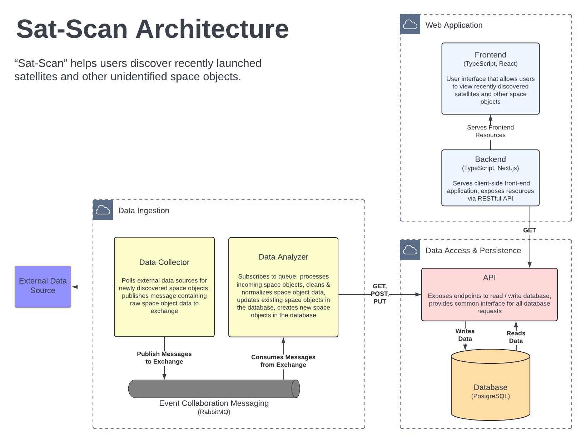

### Sat-Scan Data Ingestion

The Sat Scan system ingests data through the **Data Collector**, which periodically requests a list of recently discovered space objects from the [Space Track API](https://www.space-track.org/documentation). After requesting the data, the Data Collector publishes the space object data to a RabbitMQ broker for further processing by downstream consumers.

The **Data Analyzer** listens to the broker for new space object messages. When a new space object message is received, the Data Analyzer normalizes and enriches the space object. This enrichment and data normalization process ensures data consistency throughout the Sat Scan system.

Once the space object has been normalized, the Data Analyzer makes a GET request to the **Sat Scan API**, which reads from the **Sat Scan Database** to determine if any matching records already exist.

If the space object does not exist, a new database record is created via the Sat Scan API. If an entry already exists, the record is updated via the API. This process allows the Sat Scan system to track newly discovered/launched space objects and update existing space objects as more information comes available.

### Sat-Scan User Flow

Users engage with the Sat Scan system’s data via the **Sat Scan Web** interface. This full-stack web application fetches data from the Sat Scan API. The data, a list of recently discovered satellites and other space objects, is rendered as a list to the user. Users can then select individual space objects to display additional information.

## Production Infrastructure & Networking Overview

This system diagram provides an overview of the Sat Scan's production infrastructure and network topology. As each application and component within the system is discussed in detail below, this section should acquaint readers with a generalized overview. 

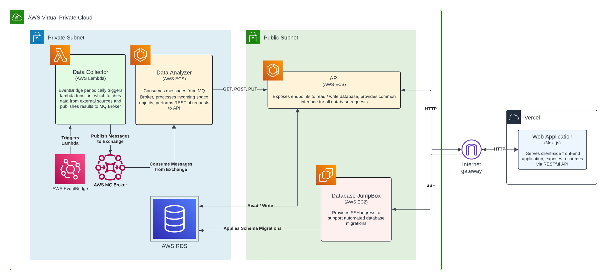


### Sat Scan Backend Infrastructure

Sat Scan's production backend system runs on [Amazon Web Services](https://aws.amazon.com/) (AWS). All of the infrastructure is provisioned using [Terraform](https://www.terraform.io/), an infrastructure as code (IaC) tool. 

- Data Collector
	- An AWS Lambda function that is triggered periodically by AWS EventBridge
	- Runs within a private subnet, preventing access from the public internet
- Event Collaboration Messaging
	- AWS MQ Broker using the RabbitMQ engine
	- Runs within a private subnet, preventing access from the public internet
- Data Analyzer
	- Runs using Amazon ECS on AWS Fargate
	- Runs with a private subnet, preventing access from the public internet
- API
	- Runs using Amazon ECS on AWS Fargate
	- Accessible to the public internet via HTTP
- Database
	- Runs using PostgreSQL AWS RDS
	- Runs within a private subnet
	- Only accessible from the API and EC2 JumpBox
- JumpBox
	- An EC2 instance providing SSH ingress and database connectivity
	- Support database schema migrations 

### Sat Scan Frontend

## Sat Scan Applications and Services

### Sat Scan Web

This project was originally borne from the idea that it would be interesting to visualize the positions of orbiting satellites on three-dimensional rendering of earth. Unfortunately, generating a 3D rendered earth using [Three.js](https://threejs.org/) proved outside the scope of this project.

For now, Sat Scan Web provides rudimentary functionality to inspect and explore data ingested by the Sat Scan backend system. 

There are a multitude of additional features and functionality that could be added to Sat Scan Web to expand the application's utility while improving the user experience.

The Sat Scan Web application currently functions as an end-user facing web application that displays a list of recent space objects. Users can select a result from the list to see a "result detail" that displays additional information about the space object.

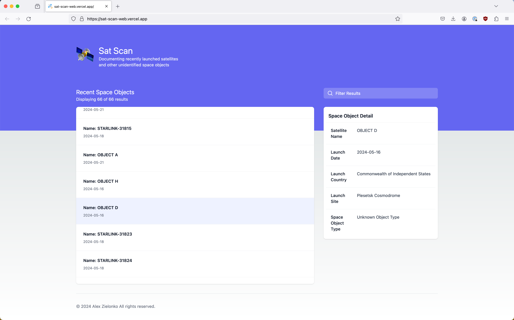

Users can filter the list of displayed space objects by “searching” for specific text in an input box. This feature currently supports filtering results by the object name, country of origin, launch site name, and object type.

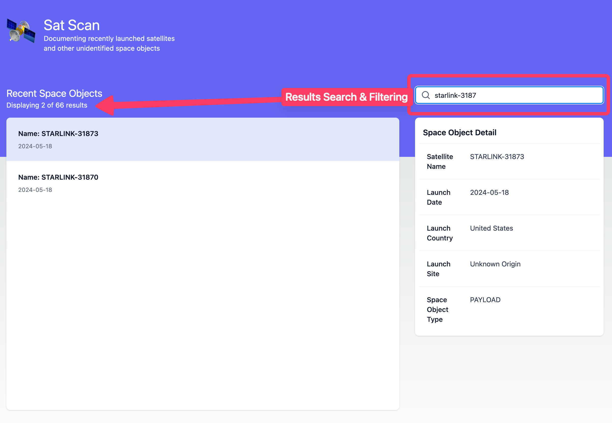

#### Sat Scan Web: Infrastructure, Continuous Integration, & Continuous Delivery

Sat Scan Web is deployed to a production environment using Vercel's Platform-as-a-Service. This straightforward integration offloads server management and configuration. 

The project uses a Vercel GitHub integration to continuously deploy anytime new commits are pushed to the `main` development branch. 

Vercel also supports "preview" deployments which allow developers to test changes in an ephemeral staging environment when new commits are pushed to a branch. Unit tests and lint checks run against the Sat Scan Web application during continuous integration checks.


### Data Collector

The Data Collector fetches data from the [Space Track API](https://www.space-track.org/documentation) and publishes the results to a RabbitMQ message broker. 

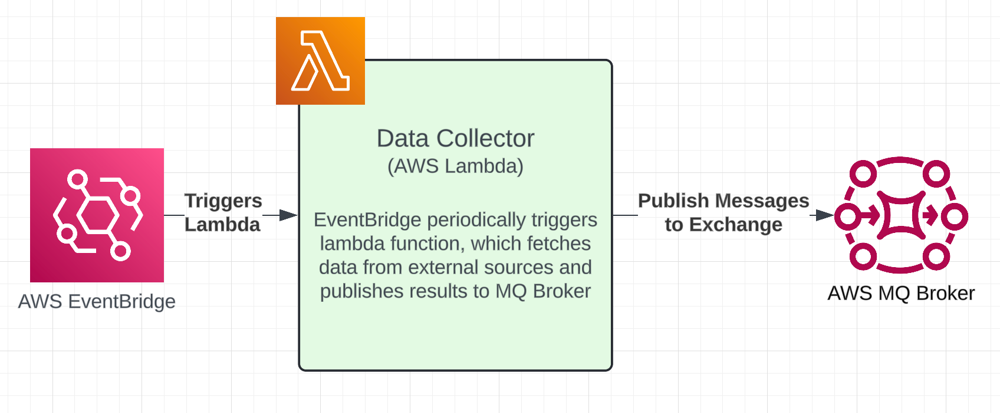


To determine which requests to make, the Data Collector parses a YAML configuration file, `applications/space-data-collector/function/components/space_track_requests.yml`.  As of this report's writing, the `space_track_request.yml` file contains a single request to fetch recently discovered space objects,

```yml
space-track-requests:
- name: space-track.org
  routing_key: recent_objects
  description: Objects launched in previous 7 days, part of Space Situation Report
  request_url: https://www.space-track.org/basicspacedata/query/class/satcat/LAUNCH/%3Enow-7/CURRENT/Y/orderby/LAUNCH%20DESC/format/json
```
 
 As the Data Collector does not modify or enrich the external responses prior to publishing to the message broker, future developers can readily extend the Data Collector to periodically fetch additional data from the Space Track API by adding new "request configuration" entries to the `space_track_requests.yml` file. Additional request should be based on the following format,
 
```YAML
- name: NAME OF THE REQUEST
  routing_key: THE NAME OF THE CHANNEL THAT THE MESSAGE WILL BE PUBLISHED TO ON THE BROKER
  request_url: THE SPACE TRACK API REQUEST URL
```

#### Data Collector: Application Extensibility

This application architecture provides a clean separation of concerns by decoupling the data ingestion from data processing, normalization, and enrichment. Downstream broker consumers read and handle the queue's messages independently from the Data Collector component. 

This decoupled design also simplifies the addition of new downstream consumers. As developers introduce new Space Track API "request configurations," new "Data Analyzers" (or other types of downstream consumers) can be added to process the messages that are published on the new channels. As a result, this application design provides an extensible approach to expand the system's data ingestion process with minimal alterations to the existing infrastructure. 

##### Data Collector: Adding Additional Data Providers 

The structure supports the addition of new data providers as well. As adding a new data provider to the existing Data Collector requires modifications to the existing application logic, it is recommended to create unique lambdas for each data provider. 

Creating a new Lambda avoids logical complexity in the existing Data Collector while taking advantage of the decoupled nature of the existing event collaboration messaging available through the RabbitMQ broker. It also allows for a unique EventBridge lambda trigger, which allows the new data source to be requested at a different frequency than the existing Space Track API. 

#### Data Collector: Infrastructure & Continuous Delivery

As with the other Sat Scan production backend components and applications, all of the infrastructure and networking for the Data Collector is provisioned using Terraform. 

The production Data Collector runs on AWS Lambda, which is triggered via an AWS EventBridge rule. 

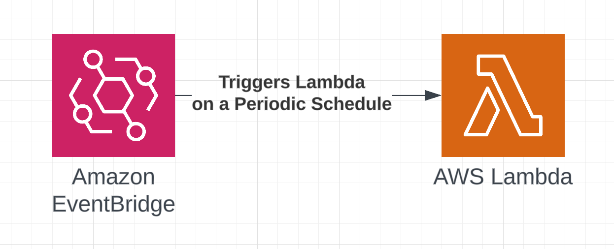


EventBridge (previously known as CloudWatch) can be used to build serverless, event-driven systems. The trigger is easily configurable within the project's Terraform code,

```hcl
resource "aws_cloudwatch_event_rule" "data_collector_lambda_trigger" {
  name = "data-collector-lambda-trigger"
  description = "Fires every 1 hour"
  schedule_expression = "rate(1 hour)"
}
```

The Data Collector does not require around the clock availability. Leveraging AWS Lambda and EventBridge as serverless compute resources helps minimize the service's operational cost. 

AWS Lambda provides a straightforward continuous delivery pipeline, which runs once the continuous integration checks pass and the GitHub pull request is merged into the `main` development branch.

During continuous integration, a GitHub Action creates a new production zip file for the Data Collector, which is then uploaded directly to the existing AWS Lambda function. Once uploaded, new Lambda invocations execute the latest Data Collector code.

An alternative architecture could utilize Amazon Elastic Compute Cloud (EC2) resources and a cron to run the data collection process on a fixed schedule. An EC2 instance may be a more appropriate option for long-running batch processes or to execute a suite of interrelated data collection processes.

### Data Analyzer

At it's core, the Data Analyzer consumes messages from the broker, normalizes them, and saves them in the database via the Sat Scan API.

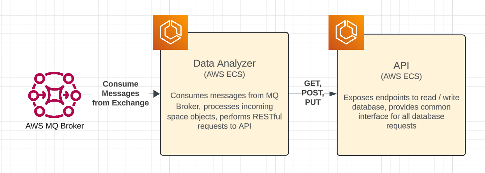


The Data Analyzer consumes raw messages from the RabbitMQ broker. When a new message is received, it normalizes the message contents by converting it to a standard data structure. This helps ensure data integrity for downstream consumers and aligns the space object data with the schema required by the Sat Scan API.

#### Data Analyzer: Internal Logic

The Space Track API publishes information on space objects of unknown origin to "help enhance spaceflight safety, prevent potentially catastrophic orbital collisions, and increase international cooperation in space."

As such, newly identified space objects are often lacking detail when they are initially ingested by the Sat Scan system. The Data Analyzer accommodates the evolution of space object data by updating existing records as new information becomes available.

To do this, the Data Analyzer checks for existing space object records with the same id. If a record is returned, the Data Analyzer enriches the existing record by making a PUT request to the Sat Scan API. If a record is not found, the Data Analyzer creates a new record by making a POST request to the API.

The request/response flow between the Data Analyzer, Sat Scan API, and Sat Scan Database is outlined in the diagrams below.

##### Data Analyzer: Create New Space Object Request/Response Diagram

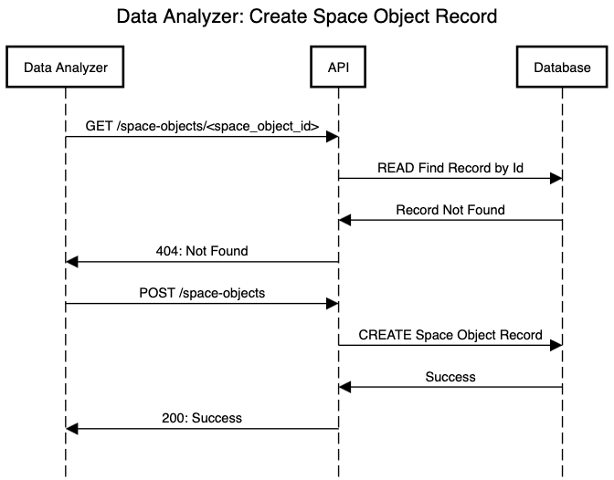

##### Data Analyzer:  Update Existing Space Object Request/Response Diagram


#### Data Analyzer: Infrastructure & Continuous Delivery

As with the other Sat Scan production backend components and applications, all of the infrastructure and networking for the Data Analyzer is provisioned using Terraform. 

The production Data Analyzer runs using Amazon Elastic Container Service (ECS) using Amazon Fargate. Together, AWS ECS & Fargate simplify operations by offloading server management, resource allocation, and scaling to AWS. 

ECS also allows for a streamlined continuous delivery pipeline, as ECS deploys the latest production build anytime a new image is uploaded to the application's Amazon Elastic Container Registry (ECR). This continuous delivery pipeline runs once the continuous integration checks pass and the GitHub pull request is merged into the `main` development branch.

During continuous delivery, a GitHub Action creates a new production build image for the Data Analyzer, which is then uploaded to the application's ECR. This triggers a new ECS deployment, which is configured to use the most recent image uploaded to the container registry.

### Sat Scan API

The Sat Scan API serves two primary functions: 
1. Limiting programmatic database access
2. Providing a public database interface

#### Sat Scan API: Limiting Programmatic Database Access

The Sat Scan API is the only way new records can be created, read, updated, or deleted (CRUD). Levering an API to perform all CRUD operations helps ensure data integrity by providing well-defined, RESTful operations. The API also helps loosely couple the Sat Scan system.

Restricting programmatic database access to the API helps simplify the system architecture as the functionality expands, such as when new data collection and analysis applications are added. 

Rather than establish a new database connection, new applications can communicate directly with the API to interact with the data. This helps decouple database and application logic, as application are not concerned with establishing database connections or managing queries.

The pattern further supports future extensibility by simplifying the introduction of breaking schema changes. When the database requires breaking schema changes, the API can be versioned or extended with new routes. This vastly simplifies the adoption of schema changes in a system with many database dependent applications, as applications can be individually updated to adopt the latest API version and schema changes. 

#### Sat Scan API: Providing a Public Database Interface

The Sat Scan Database exists within a private subnet in the Virtual Private Cloud (VPC), and it only accepts ingress from traffic within the VPC. This networking decision helps prevent the database from direct exposure to the public internet, which improves the system's security posture.

#### Sat Scan API: Endpoint Security

The API provides public GET request access without requiring any authorization.

The API limits requests to create, update, or delete records by requiring an API key in the the request header's bearer token.

```js
headers: {
    'Authorization': `Bearer ${API_KEY}`
}
```

Requests to create, update, or delete a resource will be rejected with a `401: Unauthorized` status if they lack an authorization header or include an invalid bearer token.

#### Sat Scan API: Endpoints

The following endpoints are currently available:

| GET    | /space-objects                  | Returns a list of space objects  |
| ------ | ------------------------------- | -------------------------------- |
| GET    | /space-object/:space_object_id  | Returns a single space object    |
| POST   | /space-objects                  | Creates a space object           |
| PUT    | /space-objects                  | Updates an existing space object |
| DELETE | /space-objects/:space_object_id | Deletes a single space object    |

#### Sat Scan API: Infrastructure & Continuous Delivery

All of the infrastructure and networking for the Sat Scan API is provisioned using Terraform. 

Like the Data Analyzer, the API runs using Amazon Elastic Container Service (ECS) using Amazon Fargate. The continuous integration and deployment process for the API mirrors that of the Data Analyzer.

### Sat Scan Database

#### Sat Scan Database: Infrastructure

Sat Scan's production database runs using the Amazon Relational Database Service (RDS). The database runs within a private subnet within the VPC, which prevents direct public access. As such, two public facing systems can access the database.

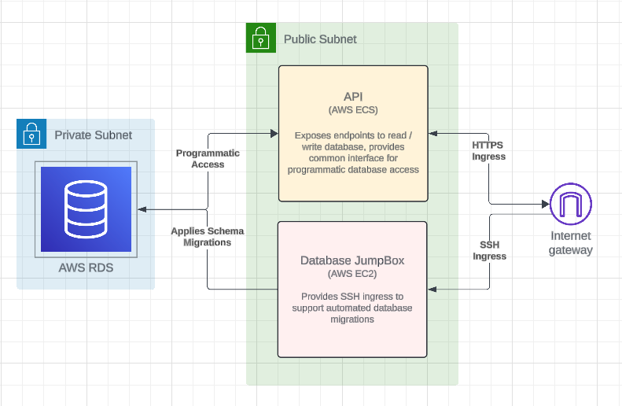


 As with Sat Scan's other production services, the database is provisioned using Terraform. It currently uses the following configuration,

```hcl
variable "settings" {
  description = "Configuration settings"
  type        = map(any)
  default = {
    "database" = {
      allocated_storage   = 20            // storage in gigabytes
      engine              = "postgres"    // engine type
      engine_version      = "16.1"        // engine version
      instance_class      = "db.t3.micro" // rds instance type
      db_name             = "sat_scan_db" // database name
      skip_final_snapshot = true
    }
  }
}
```
#### Sat Scan Database: Managing Production Migrations

Database migrations can be applied in production and locally using [Alembic](https://alembic.sqlalchemy.org/en/latest/), which is "a lightweight database migration tool for usage with the [SQLAlchemy](https://www.sqlalchemy.org) Database Toolkit for Python."

As previously discussed, the Sat Scan Database exists within a private subnet in the Virtual Private Cloud (VPC), and it only accepts ingress from traffic within the VPC. This networking decision helps prevent the database from direct exposure to the public internet, which improves the system's security posture.

To support database migrations in production, the system utilizes a "JumpBox" running on an AWS EC2 instance. The networking configuration for the JumpBox allows for SSH ingress from a specified IP address. In practice, this allows for database migration scrips to run without providing direct public internet database access.

As of this report's writing, migrations are ran against the production database after applying Terraform changes. These migrations run as part of the `/infrastructure/post_apply.sh` script. While this approach is sufficient for the immediate project needs, subsequent platform work is necessary to support database changes alongside rolling or blue-green deployments.

#### Sat Scan Database: Supporting Future Frontend Development

In the short term, this PostgreSQL database configuration provides ample support for Sat Scan's core functionality with plenty of room to expand. However, Postgres is also a deliberate choice due to its ability to handle GIS data, which serves a practical purpose in supporting the Sat Scan Web application's future feature development efforts. 

Visualizing satellites and space objects on two-dimensional map or on a three-dimensional rendering of earth would be engaging frontend application enhancements. 

PostGIS, a popular PostgreSQL extension, provides relational database support for storing, indexing, and querying geospatial data. PostGIS also supports spherical coordinates, which describe angular coordinates on a globe. This support should simplify storing satellite and space object coordinates, which will make more advanced frontend satellite positioning visualizations possible. 

### Sat Scan Event Collaboration Messaging

The Data Collector and Data Analyzer utilize a RabbitMQ broker to decouple communication between the applications. This approach allows the Data Collector to periodically request new space objects from the Space Track API and publish the raw results to the broker. Downstream consumers, such as the existing Data Analyzer, can then process the messages as appropriate.

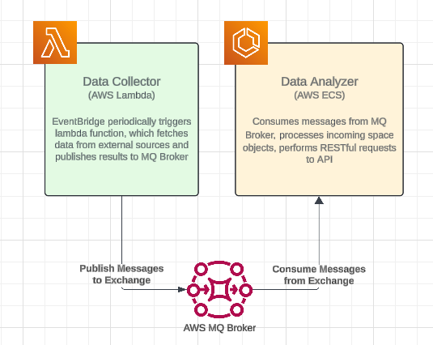


While it's easy to argue that this design is over-engineered for the system's present needs, the solution scales well for more data-intensive workloads. 

For example, consider a system that tracks the position of multiple orbiting satellites and space objects in near-real-time. Such a system might require data collection applications to publish thousands of messages per minute to the broker before processing-intensive consumers handle the messages. The existing Sat Scan system design is ready to support this quasi-real-world use case! 

Such a use case might look something like this:

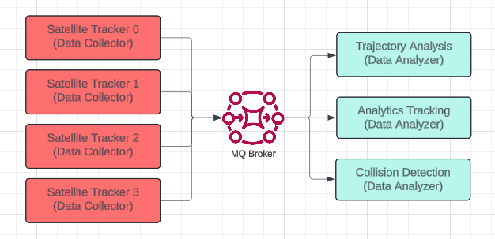


## Project Structure

All of the applications and services share a single git repository. 

```
├── applications
│   ├── sat-scan-api
│   ├── sat-scan-web
│   ├── space-data-analyzer
│   └── space-data-collector
├── databases
├── infrastructure
│   ├── database-migrations
│   └── task-definitions
└── test
    └── sat_scan_api
        └── integration
```

This "monorepo" structure groups all of the "applications" within the `/applications` directory. 

The `/infrastructure` directory contains all of the Terraform code to provision the production environment. It also contains the post-provisioning scripts to setup the database and publish production routing configurations. 

Database migrations are located within the `/databases` directory.

While application level unit tests can be found within their respective `/application/*` directories, integration tests are located within the `/test` directory.

I have enjoyed developing this project within a monorepo, as it simplifies local microservice development. 

### Local Development Environment

The `docker-compose.yml` file located at the project's root allows for the entire backend Sat System to be ran locally. The Data Collector, Data Analzyer, and Sat Scan API dockerfiles can be found in their respective directory, within `/applications`.

Alongside the three backend applications, the `docker-compose.yml` starts RabbitMQ and Database services. The configuration also supports the necessary local networking between the applications and services. 

Local Next.js application development doesn't require (nor considerably benefit from) running within a Docker container. As such, local development instructions for the Web application can found within the project and app's `README.md`.

Detailed instructions to run the Sat Scan system locally can be found in the project's main `README.md` file, located at the root directory level.

### Infrastructure as Code

This project utilizes Terraform to simplify the provisioning of Sat Scan's production systems. The Terraform configuration supports all of the system's cloud networking as well as the provisioning of each application's required infrastructure. 

The configuration is not in a "mature" state and further refactoring is planned to improve code organization, optimize for reusability, and simplify the existing `main.tf` file.

### Continuous Integration

This project features several continuous integration checks to ensure code formatting consistency and run tests.

These continuous integration checks exist as GitHub Actions, which execute anytime new commits are pushed to an open GitHub pull request. 

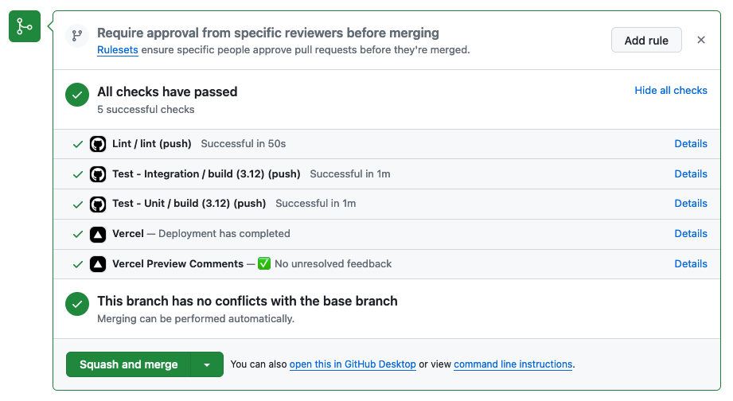

#### Linting

Before code be merged into the monorepo's `main` git branch, it must first pass checks that ensure consistent formatting.

The backend services are all written in Python, which is formatted using [Black](https://github.com/psf/black). Sat Scan Web is a TypeScript project and is formatted using [ESlint](https://eslint.org/) and [Prettier](https://prettier.io/).

Additional information on linting can be found in the project's root `README.md` file.

#### Testing

Separate GItHub actions exist for both the unit and integration tests. The unit and integration tests can also be ran locally, and instructions should be available in each application's `README.md`.

##### Unit Tests

Each application's unit test suite executes as part of the monorepo's "Unit Test" GitHub Action.  Although there is room to expand test coverage, the GitHub action executes unit tests for every application (Web, API, Data Collector, and Data Analyzer).

The unit tests use a variety of mocks and spies to validate software functionality.

##### Integration Tests

Similar to the project's unit tests, the integration tests execute as part of the continuous integration checks, anytime a new commit is pushed to an open GitHub pull request. The integration tests can be found in the "Integration Test" GitHub Action.

The existing integration tests make use of the project's docker-compose file to execute the tests against a simulated production environment. This simplifies integration test development, as each applications dockerfile can be used to run images on the same machine that the tests are executed against. This approaches allows for multiple applications and services to be tested simultaneously, such as the API & Database or the Data Collector, broker, and the Data Analyzer.

While the integration test coverage for the project is less robust than the unit test coverage, the existing integration tests for the API is particularly valuable. These tests validate all of the existing API endpoints and validate handling of API response failure conditions, such as unauthorized access and malformed payloads.

Further information on running the project's integration tests can be found in the root `README.md`.

#### Frontend Preview

Sat Scan Web is hosted on Vercel, which generates previews anytime new commits are pushed to an open GitHub pull request. This allows for frontend changes to be previewed in an ephemeral environment before they are deployed to the production. 

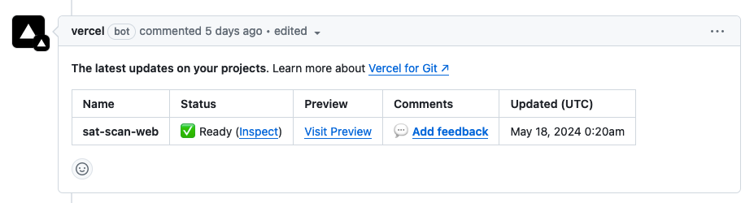

### Continuous Delivery

Backend applications (Data Collector, Data Analyzer, and Sat Scan API) are continuously deployed to their respective production environments using GitHub Actions. These Actions run anytime a pull request is merged into the `main` git branch.

Sat Scan Web similarly deploys automatically when a pull request is merged into the `main` git branch.  However, unlike the backend applications, Sat Scan Web does not require a unique GitHub Action to build and deploy the application to the production environment. This continuous deployment process is automatically handled by Vercel.

#### Service Discovery

As Terraform is used to provision the production backend services, many of the application and service endpoints are dynamically generated. 

For example, the Application Load Balancer (ALB), which provides ingress to the Sat Scan API, is accessible via a dynamically generated url. The database endpoints are also dynamically generated. The Data Analyzer needs to know the ALB url to process messages from the broker, and the API needs to know the database endpoint for read and write operations. 

The Sat Scan system provides these dynamic endpoint values to applications by running a script after applying Terraform changes (`/infrastructure/post_apply.sh`). This script transforms the Terraform output variables into an INI configuration file, `route_config.ini`. The route configuration file is then uploaded to an AWS S3 Bucket.

Prior to building new images during the continuous deployment process, applications fetch the `route_config.ini` file from the AWS S3 Bucket. This automated process allows the route configuration variables to be read by the applications at runtime. This reduces overhead associated with manually specifying routing instructions and improves security. 

### Production Monitoring

Production monitoring for the Sat Scan system is supported natively through [Amazon CloudWatch](https://aws.amazon.com/cloudwatch/). The monitoring is enhanced through application specific logging configurations, which are specified within the project's Terraform configuration.

I created two CloudWatch dashboard to surface critical system metrics and application logs. 

#### Production Monitoring: Sat-Scan-Metrics Dashboard

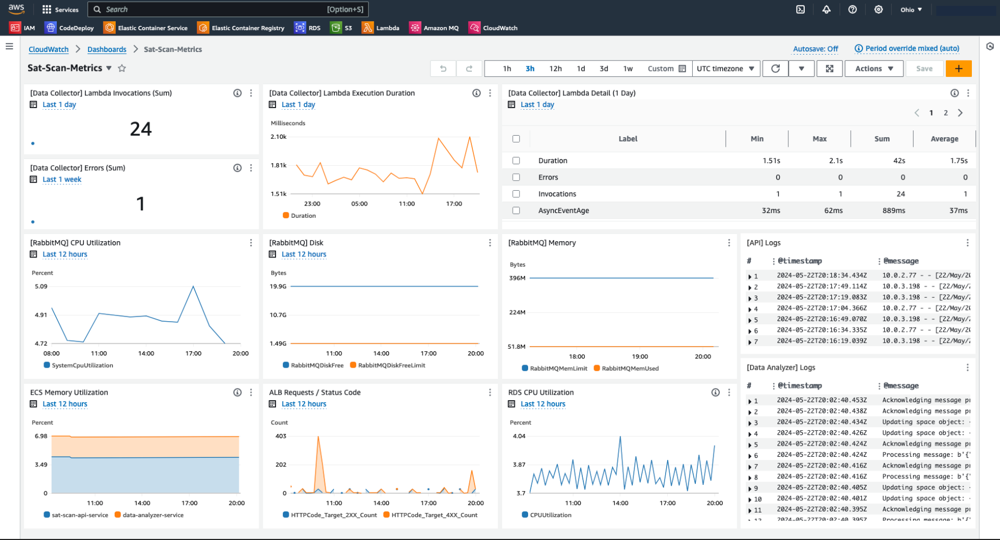

The Metrics dashboard provides observability into Sat Scan's system. This particular dashboard surfaces useful metrics about the Data Collector Lambda, the event collaboration messaging broker, the Sat Scan API, the Data Analyzer, and the database instance. 

The dashboard makes it easier to spot abnormalities, such as this spike in 4xx responses from the Application Load Balancer:

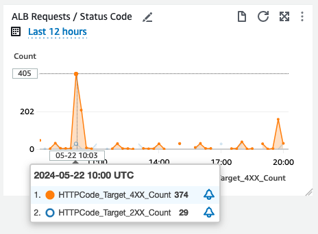

#### Production Monitoring: Sat-Scan-Logs Dashboard

I created a separate "Logs" dashboard to illuminate critical logging information in the Data Collector, the Data Analyzer, Sat Scan API processes. This dashboard makes it easy to validate that data is flowing through the system each time the Data Collector Lambda is invoked. 

The screenshot below highlights a unique space object as it flows from the Data Collector to the Data Analyzer via the messaging broker. We then see requests to the API for the same space object id, indicating that the Data Analyzer is processing the message as expected.

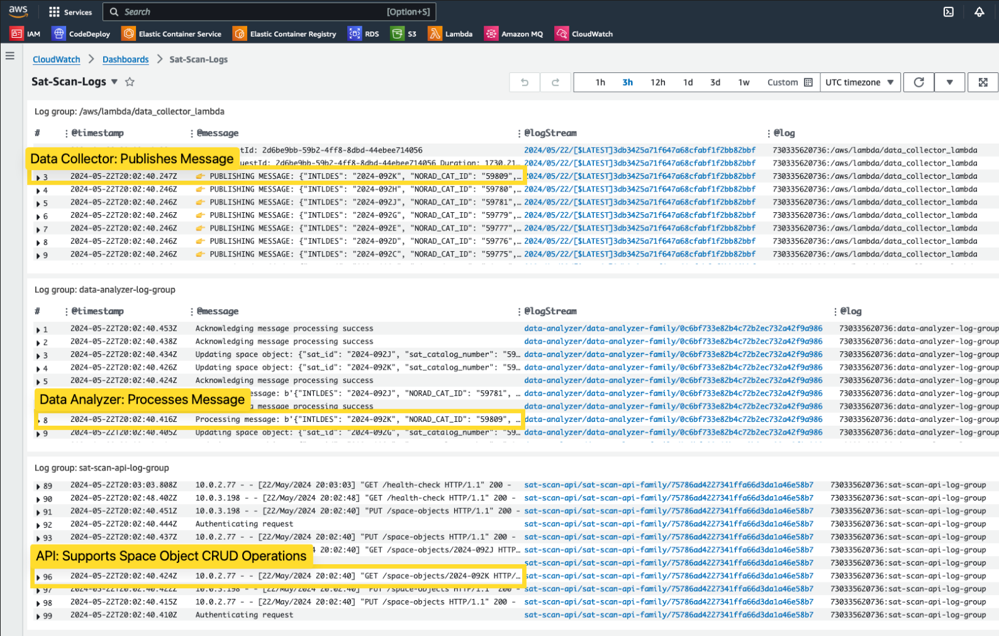


#### Production Monitoring: Additional Considerations

I love the capabilities and flexibility provided by Prometheus and Grafana, and both are worth eventually employing as the Sat Scan system grows. However, given the existing complexity of the project's cloud infrastructure, I want to use a monitoring and observability solution that does not require additional infrastructure overhead. Specifically, it's reasonable to avoid independently hosting a separate Prometheus EC2 instance for this project in the short term.

I initially opted to utilize [Grafana Cloud](https://grafana.com/products/cloud/) to implement production monitoring. I successfully configured the Grafana Cloud integration via Terraform, and starting creating a monitoring dashboard. While I initially appreciated the ability to integrate with Grafana Cloud via the project's Terraform configuration, I felt like I was duplicating functionality already provided by Amazon CloudWatch.

With this in mind, I dropped the Grafana Cloud integration and quickly built out a CloudWatch dashboard. After monitoring the production application using this setup for several days, I am happy with the decision and look forward to improving the systems observability, monitoring, and alerting setup.

## Current Production State

Using Terraform allowed me to easily provision and destroy infrastructure while developing and testing the system. 

When starting development for the day, I ran `terraform apply` to provision resources. When wrapping up for the day, I ran `terraform destroy` to spin down the cloud instances and services. This worked well for development and helped validate and tweak the AWS infrastructure. It also allowed me to repeatedly validate my `infrastructure/post_apply.sh` script, which provides routing configuration information and executes production database migrations.

Once the end-to-end cloud system was stable, I began letting the AWS resources run 24/7. As I'm running many of the system's resources on AWS' free tier, I expected the daily operational cost to be fairly low.

After a few days, I noticed that the AWS costs to run the infrastructure is higher than I originally anticipated. 

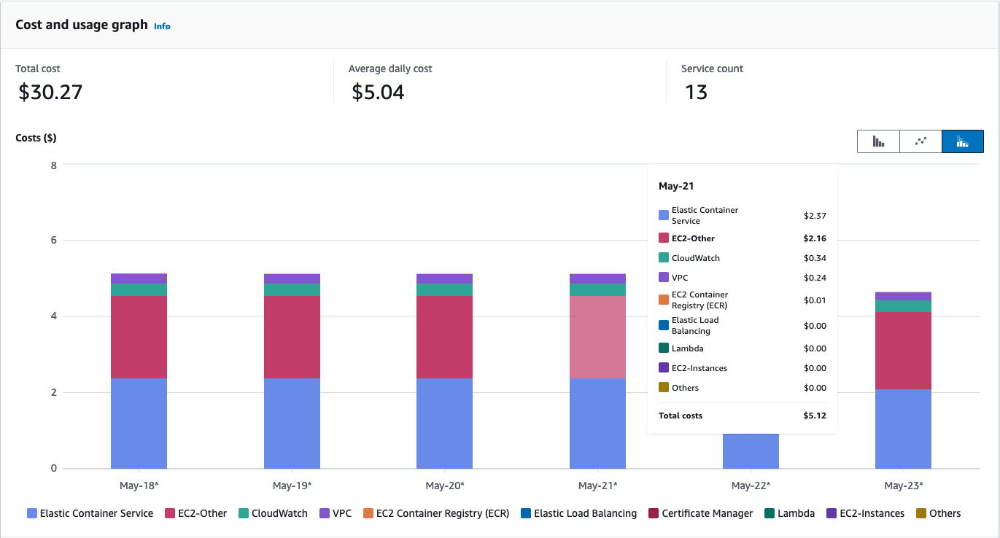


At ~$5 per day, if the system maintains the existing operational cost for the remainder of this course session, I will be facing an AWS bill in excess of $200! 

This operational cost is perfectly reasonable for a company, but it's a solid chunk of my household's grocery budget. To reduce this project's costs, I am opting to spin-down the production backend AWS infrastructure. The user-facing Sat Scan Web application will continue running, as this is hosted on Vercel's free "Hobby" tier.

To provide a representative sample of the system's data, I requested all of the existing space objects from the `GET /space-objects` API endpoint. I stored these in a JSON file, `applications/sat-scan-web/src/data/space-object-snapshot-5-23.json`. For now, the Sat Scan Web application serves these space objects rather than making a call directly to the Sat Scan API. This cost savings measure replicates the full system functionality without incurring the additional hosting costs.

With that said, I am happy to redeploy the production backend infrastructure at any time for review purposes. Developing the project with Terraform has proven a *fantastic* decision, as I can provision the entire production system's cloud infrastructure in 10-15 minutes. 

As the system has been running for several days, the Data Collector has ingested dozens of new space objects into the system. To avoid losing this data if the system is re-deployed, I created a snapshot of the AWS RDS database before terminating the instance. I then stored that database snapshot in an AWS S3 Bucket. Even though the database snapshot is 20gb, the monthly storage cost is a reasonable ~$0.46 -- substantially less than $5 per day! This allows for the snapshot to be reapplied if the database is recreated for review purposes.

## Project Next Steps

As with many software projects, I have more ideas for enhancements than time to implement them.

There are plenty of opportunities to improve the Sat Scan system. I want to briefly catalog a few, as I they represent pertinent next steps for development.

- Enhance Sat Scan Web
	- As previously mentioned, this project was originally borne from the idea that it would be cool to visualize the positions of orbiting satellites on a dimensional rendering of earth. Unfortunately, generating a 3D rendered earth using [Three.js](https://threejs.org/) proved outside the scope of this project. I would love to enhance to frontend web application to provide a greater value proposition for users. 
- Providing HTTPS network access
	- I didn't purchase  a domain name for this project, which is necessary for to provision and manage SSL/TLS certificates using AWS Certificate Manager. A cert is necessary to enable HTTPS traffic. 
	- Sat Scan Web is served via HTTPS automatically using Vercel. Due to browser security features, the production Vercel application is unable to make client-side requests directly to the API via HTTP.
	- HTTPS ingress should be added to enhance the frontend application's capabilities while improving system security.
- Terraform organization
	- This is my first foray into configuring a Terraform project from scratch, and I think immense opportunity to improve the `/infrastructure` directory's organization. I picked up the book [Terraform: Up & Running](https://www.terraformupandrunning.com/), and I'm looking forward to implementing more Terraform best practices into this project.

## Resources & References

I referenced a ton of online documentation and resources to develop this project and author this report. While I have tried to include links throughout the document for reference, the following resources are worth mentioning here as well.

- [Sequence Diagram](https://sequencediagram.org/)
	- Used to create the Request / Response diagrams in this report
- [Lucid Chart](https://www.lucidchart.com/)
	- Used to create system and network diagrams in this report
- Terraform
	- [Terraform: Up & Running](https://www.terraformupandrunning.com/)
	- [Terraform AWS Module Registry](https://registry.terraform.io/providers/hashicorp/aws/latest)
- Flask Project Organization References
	- [How To Structure Large Flask Applications](https://www.digitalocean.com/community/tutorials/how-to-structure-large-flask-applications)
	- [Structure of a Flask Project](https://lepture.com/en/2018/structure-of-a-flask-project)
- Amazon MQ Broker Setup, Configuration, & Infrastructure
	- [Using Python Pika with Amazon MQ for RabbitMQ](https://docs.aws.amazon.com/amazon-mq/latest/developer-guide/amazon-mq-rabbitmq-pika.html)
	- [Terraform Resource](https://registry.terraform.io/providers/hashicorp/aws/latest/docs/resources/mq_broker.html)
	- [Reference Implementation](https://github.com/CitizenPlane/terraform-aws-rabbitmq?tab=readme-ov-file)
- Continuous Delivery using GitHub Actions
	- [Deploying to Amazon Elastic Container Service](https://docs.github.com/en/actions/deployment/deploying-to-your-cloud-provider/deploying-to-amazon-elastic-container-service})
- General Documentation
	- [TailwindCSS](https://tailwindcss.com/docs/installation)
	- [TailwindUI](https://tailwindui.com/)
  	- Used to initially scaffold UI's React components
	- [Flask](https://flask.palletsprojects.com/en/3.0.x/)
	- [Alembic](https://alembic.sqlalchemy.org/en/latest/)
	- [SQLAlchemy](https://www.sqlalchemy.org/)
	- [Docker](https://docs.docker.com/)
	- [Next.js](https://nextjs.org/docs)
	- [Amazon MQ Broker](https://docs.aws.amazon.com/amazon-mq/latest/developer-guide/welcome.html)
